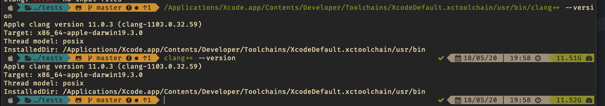
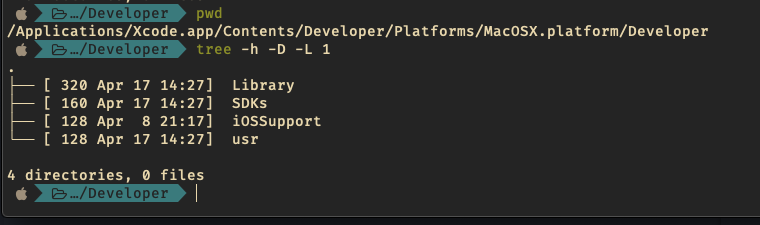
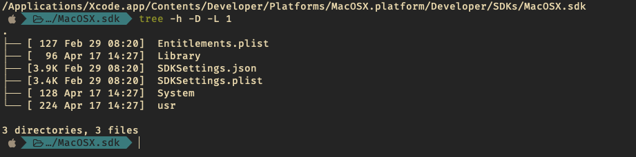
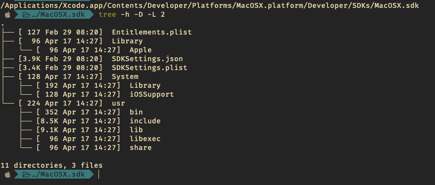
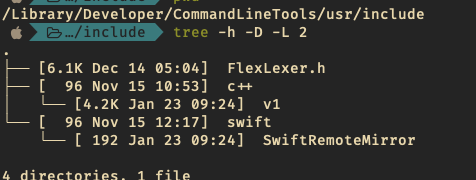
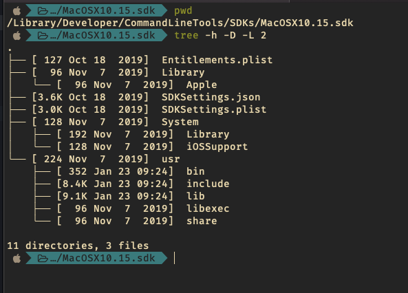

# `std::string` Darwin [clang]
Testing the `std::string` library on macOS 10.15 - Catalina

Compilation with `CLANG++` required for testing purposes within the latest macOS version.

```bash
clang++ --version
Apple clang version 11.0.3 (clang-1103.0.32.59)
Target: x86_64-apple-darwin19.3.0
Thread model: posix
InstalledDir: /Applications/Xcode.app/Cont
```

___

```bash
/Applications/Xcode.app/Contents/Developer/Toolchains/XcodeDefault.xctoolchain/usr/bin/clang++ --version
Apple clang version 11.0.3 (clang-1103.0.32.59)
Target: x86_64-apple-darwin19.3.0
Thread model: posix
InstalledDir: /Applications/Xcode.app/Contents/Developer/Toolchains/XcodeDefault.xctoolchain/usr/bin
```



## Locations for `string.h` file - `XCODE`

* `/Applications/Xcode.app/Contents/Developer/Toolchains/XcodeDefault.xctoolchain/usr/include/c++/v1`


This is a location for various headers, including CUDA wrappers and vectorization

* `/Applications/Xcode.app/Contents/Developer/Toolchains/XcodeDefault.xctoolchain/usr/lib/clang/11.0.3/include/`

Platform tools:

* `/Applications/Xcode.app/Contents/Developer/Platforms/MacOSX.platform`





SDK include directory

* `/Applications/Xcode.app/Contents/Developer/Platforms/MacOSX.platform/Developer/SDKs/MacOSX.sdk/usr/include/string.h`




## Locations for `string.h` file - `CommandLineTools`



* `/Library/Developer/CommandLineTools/usr/include/c++/v1`



* `/Library/Developer/CommandLineTools/SDKs/MacOSX10.15.sdk/usr/include`

### clang++ locations 

* clang - [symlink to `/usr/bin/`] `/Library/Developer/CommandLineTools/usr/bin`
* clang - [symlink to `/usr/bin`] `/Applications/Xcode.app/Contents/Developer/Toolchains/XcodeDefault.xctoolchain/usr/bin`