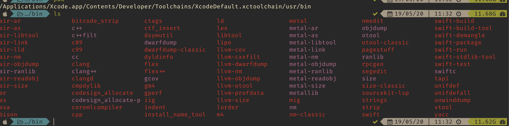

# Fixing the XCode's `clang++` compiler on macOS Catalina

> The **Command Line Tools** are not installed on the machine.  
> Only **XCode** - latest version is installed.

## Sources used in this guide:

* [^2] : The GCC documentation
* [^3] : library linking

The standard compiler on Apple's operating system is `clang`, which provides compiler support for both `C` and `C++` programming languages.

Before the Catalina update, the compiler was in the UNIX standard location `/usr/bin/`, and the standard headers (e.g. `string.h`, `math.h`) were found in `/usr/local/include/`.


In the recent Catalina update, the `C++` compiler is now provided by XCode, with the default path in:


> `/Applications/Xcode.app/Contents/Developer/Toolchains/XcodeDefault.xctoolchain/usr/bin`



And the include folder with all the headers is located at:

> `/Applications/Xcode.app/Contents/Developer/Platforms/MacOSX.platform/Developer/SDKs/MacOSX10.15.sdk/usr/include/`


***Important***: The binaries in the SDK does not provide the required compilers (`clang`/`clang++`). These compilers are found in the path provided before this section.

However, there is another path which has both the header files:

* The binaries are in: `/Applications/Xcode.app/Contents/Developer/Toolchains/XcodeDefault.xctoolchain/usr/bin`
* The include files (**headers**) are in: `/Applications/Xcode.app/Contents/Developer/Toolchains/XcodeDefault.xctoolchain/usr/include`


# The actual issue  - compiling C++ projects

The compiler provided in the path can be used for compiling various C++ sources.

```C++
#include "../include/printer.hh"
int main()
{
    auto x = printer::Printer();
}
```

This is a simple file (using the `C++11` standard) that prints a name with a method important from another source. Compilation will result in:

```bash
/Applications/Xcode.app/Contents/Developer/Toolchains/XcodeDefault.xctoolchain/usr/bin/clang++ ../src/printer.cc simple_test.cc
simple_test.cc:5:5: warning: 'auto' type specifier is a C++11 extension [-Wc++11-extensions]
    auto x = printer::Printer();
    ^
1 warning generated.
```

which is indeed working (warning is present because the compilation was done without the extra flag for using proper `C++` standard.)

> However, before the **extra step** which can be found below, compilation errors regarding missing headers occured.

### Solve:

1. The first method is to include the missing headers in the command line with `-Ipath/to/include/`
   * This method works per compilation, and must be used each time a source requires compilation from command line. 

> The correct path for the present case was: `/Applications/Xcode.app/Contents/Developer/Platforms/MacOSX.platform/Developer/SDKs/MacOSX10.15.sdk/usr/include/`

However, the alternative include directory (provided in the *Toolchains*) might work was well.

Aditionally, if the machine has `Command Line Tools`, the following path can work as well:
> `/Library/Developer/CommandLineTools/usr/include/c++/v1`

According to a github [issue](https://github.com/Homebrew/homebrew-core/issues/32765#), it is possible and also **mandatory** to flag the extra include directory in the compilation command, just like described in the following [comment](https://github.com/Homebrew/homebrew-core/issues/32765#issuecomment-427809788):

>Just found that clang++ requires explicit includes for successful compilation (I copied'em from brew test llvm):

```bash
/usr/local/Cellar/llvm/7.0.0/bin/clang++ 
-I/Applications/Xcode.app/Contents/Developer/Toolchains/XcodeDefault.xctoolchain/usr/include/c++/v1
-I/Applications/Xcode.app/Contents/Developer/Toolchains/XcodeDefault.xctoolchain/usr/lib/clang/10.0.0/include
-I/Applications/Xcode.app/Contents/Developer/Platforms/MacOSX.platform/Developer/SDKs/MacOSX10.14.sdk/usr/include source.cpp
```

1. The second method implies **exporting the C path**, which is an environment variable provided by `GCC`, as can be seen [here](https://gcc.gnu.org/onlinedocs/gcc/Environment-Variables.html).

From the source [^1]:  
> Some additional environment variables affect the behavior of the preprocessor.  
> CPATH  
> C_INCLUDE_PATH  
> CPLUS_INCLUDE_PATH  
> OBJC_INCLUDE_PATH  
>Each variable’s value is a list of directories separated by a special character, much like PATH, in which to look for header files. The special character, PATH_SEPARATOR, is target-dependent and determined at GCC build time. For Microsoft Windows-based targets it is a semicolon, and for almost all other targets it is a colon.  
>CPATH specifies a list of directories to be searched as if specified with -I, but after any paths given with -I options on the command line. This environment variable is used regardless of which language is being preprocessed.  
>The remaining environment variables apply only when preprocessing the particular language indicated. Each specifies a list of directories to be searched as if specified with -isystem, but after any paths given with -isystem options on the command line.  
>In all these variables, an empty element instructs the compiler to search its current working directory. Empty elements can appear at the beginning or end of a path. For instance, if the value of CPATH is :/special/include, that has the same effect as ‘-I. -I/special/include’.

### Exporting the `CPATH`

On this machine, the following path was exported, via the command line:

```bash
export CPATH=/Applications/Xcode.app/Contents/Developer/Platforms/MacOSX.platform/Developer/SDKs/MacOSX10.15.sdk/usr/include
```

**Observation:** This requires that each time a new terminal windows is created, the `CPATH` must be exported again. One can see that path value with:

```bash
echo $CPATH
```

A better solution: **source the command to the `.zshrc` or `.bashrc` dotfile, exporting the path each time a new terminal instance is spawned.


After the command is added in the `.rc` file, save the changes with:

```bash
source ~/.zshrc
```

## Customizing `CMake` - compilation and header files

In order to chose different compilers when building a project with CMake, the following commands can be uses:

```cmake
set(CMAKE_C_COMPILER "/Applications/Xcode.app/Contents/Developer/Toolchains/XcodeDefault.xctoolchain/usr/bin/clang")
set(CMAKE_CXX_COMPILER "/Applications/Xcode.app/Contents/Developer/Toolchains/XcodeDefault.xctoolchain/usr/bin/clang++")
include_directories("/Applications/Xcode.app/Contents/Developer/Toolchains/XcodeDefault.xctoolchain/usr/include/c++/v1/")
```

> The paths can be changed accordingly to the chosen compilers.

[^1]: [Environment Variables Affecting GCC](https://gcc.gnu.org/onlinedocs/gcc/Environment-Variables.html)

[^2]:[env_Vars](https://gcc.gnu.org/onlinedocs/gcc/Environment-Variables.html)

[^3]: [article on library linking](https://homepages.inf.ed.ac.uk/imurray2/compnotes/library_linking.txt)